# FixMyProblem

### 1、ImageView的background和src的不同
如果两个属性同时存在,用户会看到 src 属性中设置的背景. 但同时 background 设置的背景也存在, 只是被 src 属性挡住了,在后面. src 等于是前景, background 等于是背景.background 会根据 ImageView 组件给定的长宽进行拉伸, 而 src 就存放的是原图的大小, 不会进行拉伸。src 是图片内容（前景）, bg 是背景, 可以同时使用.此外: scaleType 只对 src 起作用,比如在 ImageView 中就可以用 android:scaleType 控制图片的缩放方式 ; bg 可设置透明度.
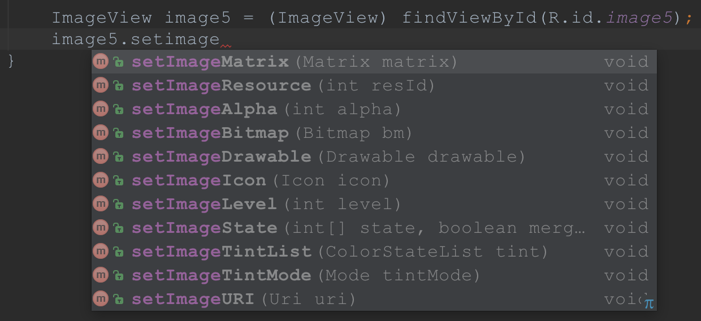
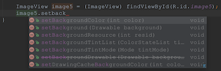

### 2、Glide加载圆形图和圆角图
```java
package com.example.leeeyou.fixmyproblem;

import android.content.Context;
import android.content.res.Resources;
import android.graphics.Bitmap;
import android.graphics.BitmapShader;
import android.graphics.Canvas;
import android.graphics.Paint;
import android.graphics.RectF;
import android.os.Bundle;
import android.support.v7.app.AppCompatActivity;
import android.widget.ImageView;

import com.bumptech.glide.Glide;
import com.bumptech.glide.load.engine.bitmap_recycle.BitmapPool;
import com.bumptech.glide.load.resource.bitmap.BitmapTransformation;

public class Problem02_GlideActivity extends AppCompatActivity {

    @Override
    protected void onCreate(Bundle savedInstanceState) {
        super.onCreate(savedInstanceState);
        setContentView(R.layout.activity_glide);

        String imageUrl = "http://7xptzi.com1.z0.glb.clouddn.com/19%E4%BA%91%E8%AF%BE%E5%A0%82_06.png";

        ImageView img01 = (ImageView) findViewById(R.id.img01);
        ImageView img02 = (ImageView) findViewById(R.id.img02);
        ImageView img03 = (ImageView) findViewById(R.id.img03);
        //Glide.with(this).load(imageUrl).thumbnail(0.1f).into(img01);

        // play gif
        Glide.with(this).load(R.mipmap.pkq).into(img01);

        // round image
        Glide.with(this)
                .load(imageUrl)
                .crossFade()
                .transform(new GlideRoundTransform(this))
                .into(img02);

        // circle image
        Glide.with(this)
                .load(imageUrl)
                .crossFade()
                .transform(new GlideCircleTransform(this))
                .into(img03);

    }

    public class GlideCircleTransform extends BitmapTransformation {

        public GlideCircleTransform(Context context) {
            super(context);
        }

        @Override
        protected Bitmap transform(BitmapPool pool, Bitmap toTransform, int outWidth, int outHeight) {
            return circleCrop(pool, toTransform);
        }

        private Bitmap circleCrop(BitmapPool pool, Bitmap source) {
            if (source == null) return null;

            int size = Math.min(source.getWidth(), source.getHeight());
            int x = (source.getWidth() - size) / 2;
            int y = (source.getHeight() - size) / 2;

            Bitmap squared = Bitmap.createBitmap(source, x, y, size, size);

            Bitmap result = pool.get(size, size, Bitmap.Config.ARGB_8888);
            if (result == null) {
                result = Bitmap.createBitmap(size, size, Bitmap.Config.ARGB_8888);
            }

            Canvas canvas = new Canvas(result);
            Paint paint = new Paint();

            paint.setShader(new BitmapShader(squared, BitmapShader.TileMode.CLAMP, BitmapShader.TileMode.CLAMP));
            paint.setAntiAlias(true);

            float radius = size / 2f;
            canvas.drawCircle(radius, radius, radius, paint);

            return result;
        }

        @Override
        public String getId() {
            return getClass().getName();
        }
    }

    public class GlideRoundTransform extends BitmapTransformation {

        private float radius = 0f;

        public GlideRoundTransform(Context context) {
            this(context, 4);
        }

        public GlideRoundTransform(Context context, int dp) {
            super(context);
            this.radius = Resources.getSystem().getDisplayMetrics().density * dp;
        }

        @Override
        protected Bitmap transform(BitmapPool pool, Bitmap toTransform, int outWidth, int outHeight) {
            return roundCrop(pool, toTransform);
        }

        private Bitmap roundCrop(BitmapPool pool, Bitmap source) {
            if (source == null) return null;

            Bitmap result = pool.get(source.getWidth(), source.getHeight(), Bitmap.Config.ARGB_8888);
            if (result == null) {
                result = Bitmap.createBitmap(source.getWidth(), source.getHeight(), Bitmap.Config.ARGB_8888);
            }

            Canvas canvas = new Canvas(result);
            Paint paint = new Paint();
            paint.setShader(new BitmapShader(source, BitmapShader.TileMode.CLAMP, BitmapShader.TileMode.CLAMP));
            paint.setAntiAlias(true);
            RectF rectF = new RectF(0f, 0f, source.getWidth(), source.getHeight());
            canvas.drawRoundRect(rectF, radius, radius, paint);
            return result;
        }

        @Override
        public String getId() {
            return getClass().getName();
        }
    }

}

```
### 3、setCompoundDrawablesWithIntrinsicBounds的优势
有两个方法可以设置控件的上下左右图标，分别是：  
**第一个方法**：setCompoundDrawablesWithIntrinsicBounds(Drawable left, Drawable top, Drawable right, Drawable bottom)  
**第二种方法**：setCompoundDrawables(Drawable left, Drawable top, Drawable right, Drawable bottom)  

它们的区别是使用第二种方法之前必须已经setBound(Rect)了，api原文如下
> Sets the Drawables (if any) to appear to the left of, above, to the right of, and below the text. Use null if you do not want a Drawable there. The Drawables must already have had setBounds(Rect) called.

所以：  
如果想手动设置大小的话就要用setCompoundDrawables，事先要给Drawable设置setBounds；  
如果按照原有比例大小显示图片就使用setCompoundDrawablesWithIntrinsicBounds  

### 4、滑动事件冲突的处理
**场景**：官方比赛数据页签 - 淘汰赛和积分赛数据 → viewpager(水平) + scrollView(垂直) + HorizontalScrollView(水平) / ListView(垂直)  
**分析**：这里的冲突在于水平事件里面嵌套垂直，再嵌套水平和垂直事件  
**解决**：采用内部拦截法配合getParent().requestDisallowInterceptTouchEvent(false);  

效果图如下：
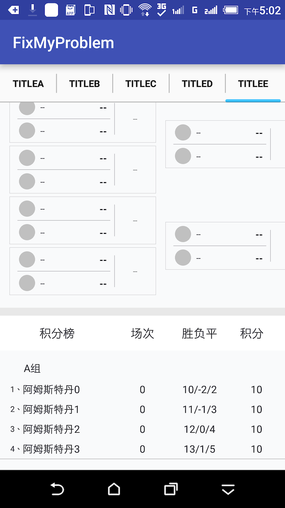

这篇日志也记录了[Android事件体系的知识](http://leeeyou.xyz/Android-Android%E8%89%BA%E6%9C%AF%E6%8E%A2%E7%B4%A2-%E6%8B%86%E4%B9%A6-%E7%AC%AC%E4%B8%89%E7%AB%A0)

### 5、shape资源整理
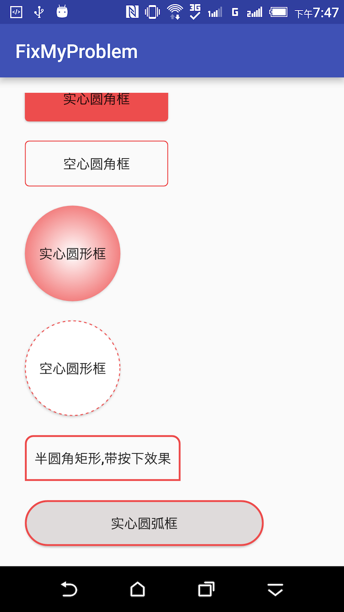

**android:shape=["rectangle" | "oval" | "line" | "ring"]**  
shape的形状，默认为矩形，可以设置为矩形（rectangle）、椭圆形(oval)、线性形状(line)、环形(ring)下面的属性只有在android:shape="ring时可用：  
android:innerRadius    尺寸，内环的半径。  
android:innerRadiusRatio    浮点型，以环的宽度比率来表示内环的半径，例如，如果android:innerRadiusRatio，表示内环半径等于环的宽度除以5，这个值是可以被覆盖的，默认为9.  
android:thickness    尺寸，环的厚度  
android:thicknessRatio    浮点型，以环的宽度比率来表示环的厚度，例如，如果android:thicknessRatio="2"， 那么环的厚度就等于环的宽度除以2。这个值是可以被android:thickness覆盖的，默认值是3.  
android:useLevel    boolean值，如果当做是LevelListDrawable使用时值为true，否则为false.  

**corners**  
android:radius                                 整型半径  
android:topLeftRadius                    整型左上角半径  
android:topRightRadius                  整型右上角半径  
android:bottomLeftRadius              整型左下角半径  
android:bottomRightRadius            整型右下角半径  

**渐变色**  
android:startColor         颜色值 起始颜色  
android:endColor          颜色值结束颜色  
android:centerColor      整型渐变中间颜色，即开始颜色与结束颜色之间的颜色  
android:angle                整型渐变角度(PS:当angle=0时，渐变色是从左向右。 然后逆时针方向转，当angle=90时为从下往上。angle必须为45的整数倍)  
android:type             ["linear" | "radial" | "sweep"] 渐变类型(取值：linear、radial、sweep)
                         linear 线性渐变，这是默认设置
                         radial 放射性渐变，以开始色为中心。
                         sweep 扫描线式的渐变。  
android:useLevel             ["true" | "false"]如果要使用LevelListDrawable对象，就要设置为true。设置为true无渐变。false有渐变色  
android:gradientRadius   整型渐变色半径.当 android:type="radial" 时才使用。单独使用 android:type="radial"会报错。  
android:centerX               整型渐变中心X点坐标的相对位置  
android:centerY               整型渐变中心Y点坐标的相对位置  

**描边**  
android:width                   整型描边的宽度  
android:color                    颜色值描边的颜色  
android:dashWidth           整型表示描边的样式是虚线的宽度， 值为0时，表示为实线。值大于0则为虚线。  
android:dashGap              整型表示描边为虚线时，虚线之间的间隔 即“ - - - - ”  


### 6、记录bug:Manifest merger failed error
由于build.gradle文件中的defaultConfig中的信息和其他module中的不同。检查minSdkVersion、targetSdkVersion是否和其他module一致

### 7、整理ripple
```xml
<?xml version="1.0" encoding="utf-8"?>
<ripple xmlns:android="http://schemas.android.com/apk/res/android"
    android:color="@color/txt_ed4d4d"><!-- 波纹颜色 -->

    <!-- 定义一个带圆角的背景 -->
    <item>
        <shape android:shape="rectangle">
            <!-- 正常状态下的颜色 -->
            <solid android:color="@color/txt_blue" />

            <stroke
                android:width="2dp"
                android:color="@color/txt_ed4d4d" />

            <corners
                android:bottomLeftRadius="0dp"
                android:bottomRightRadius="0dp"
                android:topLeftRadius="8dp"
                android:topRightRadius="8dp" />

        </shape>
    </item>

</ripple>
```
### 8、整理fragment universalAdapter notify不成功的原因
nofityDataSetChange不成功的原因：  
1、数据源没有更新，调用notifyDataSetChanged无效。  
2、数据源更新了，但是它指向新的引用，调用notifyDataSetChanged无效。  
3、数据源更新了，但是adpter没有收到消息通知，无法动态更新列表。  

由于在Fragment中调用notifyDataSetChange老是不成功，所以决定好好的研究研究为何UniversalAdapter会引起此问题。

其实好好的理解上面三条之后，解决ListView刷新不显示的问题，肯定妥妥的。

**总结起来就是：数据源的引用一定不能变，但是塞到数据源中的数据一定要更新。牢牢地掌握好这一条之后，ListView刷新不显示的问题就迎刃而解了。**

**解决“数据源的引用一定不能变”的问题**，可以提前创建一个List对象， mData = new ArrayList<>(); 之后一直对这个mData倒腾即可，不要再引入新的数据源，也就是不要再改变mData的引用地址。

**解决“但是塞到数据源中的数据一定要更新”的问题**，可以通过更新数据完成，万一数据源就是没有更新，又想要塞到数据源中，可以通过  
mData.clear();  
mData.addAll(data);  
方法实现。

这次bug的产生就是由于没有事先创建一个mData的对象，直接将入参赋值给mData，导致执行  
mData.clear();  
mData.addAll(data);  
时，先清空了数据集，然后将空数据集添加到了mData中，此时再去调用notifyDataSetChanged()时，其实生效了，但是数据为0，当然就展示了空白页。

同时需要再次调用setAdapter()方法。

通过这次的bug解决，自己认识到遇到问题时，最好追根究底的去解决它。因为你一定会不止一次遇到这个问题。当你彻底理解和掌握了之后，下次再遇到同样的问题时，显然就不是问题了。

解决方法截图：

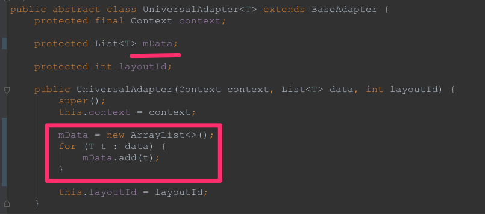
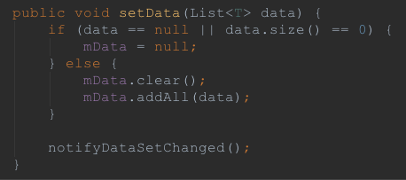

### 9、记录bug：recyclerView在fragment中 notifyDataSetChange不起作用的问题
**现象**：在创建一口价时，activity中放置了两个fragment，选择图片时，跳转到另外一个界面，返回时，又重新创建了fragment  
**分析**：由于采用ViewPager放置两个fragment，在每次切换的是否都创建了新的fragment，导致每次选好照片之后回到viewpager时，又重新创建了新的fragment，所以notifyDataSetChange无效。  
**解决**：两个fragment用全局变量记录保存，不要每次创建新的。  
**后续**：在adapter.getlist.size 返回0时，就应该联想到是否fragment被重新创建了。以此记录  

### 10、EventBus粘性事件
EventBus默认支持一条事件总线，通常是通过getDefault()方法获取EventBus实例，但也能通过直接new EventBus这种最简单的方式获取多条事件总线，彼此之间完全分开。例子见com.example.leeeyou.fixmyproblem.Problem05_EventBusActivity

EventBus#Register()其实只做了三件事：  
1. 查找订阅者所有的订阅事件  
2. 将订阅事件作为key，所有订阅了此订阅事件的订阅者作为value存放进subscriptionsByEventType  
3. 将订阅者作为key，订阅者的所有订阅事件作为value存放进typesBySubscriber  

EventBus#Post()也只做了三件事:  
1. 根据订阅事件在subscriptionsByEventType中查找相应的订阅者  
2. 分发订阅者的订阅事件调用线程  
2. 通过反射调用订阅者的订阅事件  

粘性事件：发送事件之后再订阅该事件也能收到该事件，跟粘性广播类似。简单来说就是能够收到订阅之前发送的消息。

### 11、事件传递机制
① 假设最高层View叫OuterLayout，中间层View叫InnerLayout，最底层View叫MyVIew。调用顺序是这样的（假设各个函数返回的都是false）  
OuterLayout.onInterceptTouchEvent->InnerLayout.onInterceptTouchEvent->MyView.onTouchEvent->InnerLayout.onTouchEvent->OuterLayout.onTouchEvent。
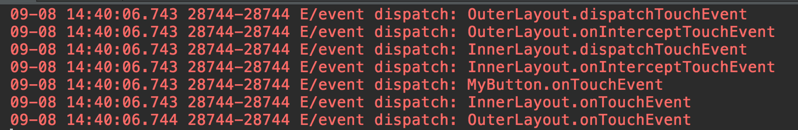

② 内部拦截法，子控件拦截父控件事件  
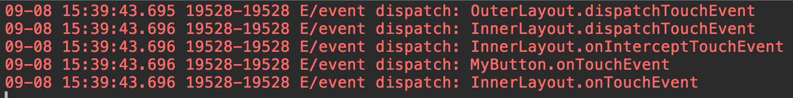

③ 注意点  
一个view一旦拦截一个某个事件，当前事件所在的完整事件序列将都会由这个view去处理，反应在真实的代码中，就是一旦view拦截了down事件，那么此后的move和up事件都将不调用onInterceptTouchEvent，而直接由它处理，这就也意味着在onInterceptTouchEvent处理事件是不合适的，因为有可能来了事件，却直接跳过onInterceptTouchEvent方法。这个也意味着，一旦一个ViewGroup没有拦截ACTION_DOWN，那么这个事件序列的其他Action，它都将收不到，所以在处理ACTION_DOWN的时候，尤其需要谨慎。

④ 注意点  
onTouchEvent中是要判断MotionEvent的Action，因为一次点击操作就会调用两次onTouchEvent方法，一次是ACTION_DOWN，一次是ACTION_UP，如果手滑一下，还会有若干个ACTION_MOVE

⑤问题：TextView的onTouchEvent的返回值也是True吗？  
是的，那为什么点在TextView上面还是能触发它的父视图的onTouchEvent，理论上应该是TextView消耗掉这次的事件，不回传。理论上确实是这样，但是因为TextView的clickable和longClickable属性都是false，当这两个属性都为false的时候，是不会消耗事件的，所以TextView不会消耗事件，这也就可以解释为什么把一个TextView放在一个Button上面，然后点击TextView还是能触发Button的点击事件

⑥问题：view的enable状态和onTouchEvent之间的关系  
它们之间没有关系，只有clickable状态才对onTouchEvent有影响的，还有一点 ，设置 view的enable为false确实也会把view的clickable设成false，但是设置view的onclickListener就又把view的clickable变成了true，所以最后的解决方案就是把那两行代码换下先后顺序，问题就迎刃而解了。

⑦问题：onTouchListener OnTouchEvent OnClickListener  
onTouchListener是在onTouch方法中生效，而且onTouch要先于onTouchEvent，就是说一旦设置了onTouchListener并且最后onTouch方法返回了True，那onTouchEvent将不会再被执行。而onClickListener和onTouchEvent有些关系，onTouchEvent的默认实现里会调用onClickListener的onClick方法，如果重写了onTouchEvent，因为onClickListener接受不到ACTION_DOWN和ACTION_UP，那么再设置onClickListener也就不会再生效了，这个时候的单击或者长按处理只能在onTouchEvent中自己处理。

### 12、9patch
为什么叫9patch呢？Patch的中文意思是"片，块"的意思，那这里按中文的意思来说就是9片或9块.因此可想而知这个图片会被分为9片，如下图片所示:  
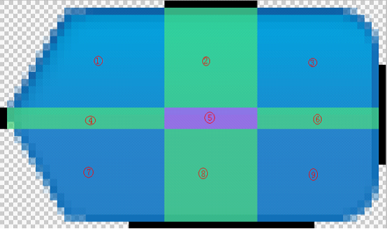  
工具栏中的Show patches选中，中间紫色的区域就是拉伸区域。  
工具栏中的Show content选中，看见蓝色的区域，这片区域就是显示内容的区域；比如说：这个图片宽有30px,我们把下面的那一条线的横向的第20px到25px画上了黑点，那么这个图片设置成某个组件的背景后，这个组件的paddingleft就会设置成20dp,paddingRight就会设置成5dp,如果再在布局文件里面设置这两个值，那个这里画的黑点就不起作用了。


工具栏中的Show bad patches选中，可能会出现下图效果：  
  
其中被选中的3块不符合要求。这里它是根据什么来判断这个绘制的结果不符合要求呢？怎么就认为这三块不符合要求呢？它是根据左侧的黑色的小点所对过来的部分里面的每一个像素点的颜色是否一样。如果像素存在差异，当背景变大的时候就有两种颜色要被重复的绘制，系统就不知道到底绘制这两种颜色哪一种多一点，因此这个工具建议被拉伸的区域只能选择一种颜色。  

如果对结果要求比较高的,右下角坐标显示区域就起作用了。

### 13、Fragment的使用总结
1、replace和add方式的区别

replace 是先remove掉相同containerViewId的所有fragment，然后在add当前的这个fragment。  
>Replace an existing fragment that was added to a container. This is essentially the same as calling remove(Fragment) for all currently added fragments that were added with the same containerViewId and then add(int, Fragment, String) with the same arguments given here.

add 是把一个fragment添加到一个容器 container 里。  
>Add a fragment to the activity state. This fragment may optionally also have its view (if Fragment.onCreateView returns non-null) into a container view of the activity.

而至于返回键，这个跟事务有关，跟使用add还是replace没有任何关系。

2、采用replace时的生命周期流转

加载fragment  
09-09 17:17:40.906 E: LifeCycle01Fragment onAttach  
09-09 17:17:40.906 E: LifeCycle01Fragment onCreate  
09-09 17:17:40.911 E: LifeCycle01Fragment onCreateView  
09-09 17:17:40.912 E: LifeCycle01Fragment onViewCreated  
09-09 17:17:40.912 E: LifeCycle01Fragment onActivityCreated  
09-09 17:17:40.912 E: LifeCycle01Fragment onStart  
09-09 17:17:40.912 E: LifeCycle01Fragment onResume  

屏幕灭掉  
09-09 16:37:30.910 E: LifeCycle01Fragment onPause  
09-09 16:37:30.953 E: LifeCycle01Fragment onSaveInstanceState  
09-09 16:37:30.953 E: LifeCycle01Fragment onStop  

点亮屏幕  
09-09 16:38:05.967 E: LifeCycle01Fragment onStart  
09-09 16:38:05.976 E: LifeCycle01Fragment onResume  

切换到其他的fragment  
09-09 16:38:30.691 E: LifeCycle01Fragment onPause  
09-09 16:38:30.691 E: LifeCycle01Fragment onStop  
09-09 16:38:30.691 E: LifeCycle01Fragment onDestroyView  
09-09 16:38:30.691 E: LifeCycle01Fragment onDestroy  
09-09 16:38:30.691 E: LifeCycle01Fragment onDetach  

切换回本身（相当于重新加载fragment）  
09-09 17:19:19.368 E: LifeCycle01Fragment onAttach  
09-09 17:19:19.368 E: LifeCycle01Fragment onCreate  
09-09 17:19:19.371 E: LifeCycle01Fragment onCreateView  
09-09 17:19:19.372 E: LifeCycle01Fragment onViewCreated  
09-09 17:19:19.372 E: LifeCycle01Fragment onActivityCreated  
09-09 17:19:19.372 E: LifeCycle01Fragment onStart  
09-09 17:19:19.372 E: LifeCycle01Fragment onResume  

回到桌面  
09-09 16:39:49.689 E: LifeCycle01Fragment onPause  
09-09 16:39:49.803 E: LifeCycle01Fragment onSaveInstanceState  
09-09 16:39:49.803 E: LifeCycle01Fragment onStop  

回到应用  
09-09 16:40:10.743 E: LifeCycle01Fragment onStart  
09-09 16:40:10.743 E: LifeCycle01Fragment onResume  

退出应用  
09-09 16:44:06.357 E: LifeCycle01Fragment onPause  
09-09 16:44:06.662 E: LifeCycle01Fragment onStop  
09-09 16:44:06.663 E: LifeCycle01Fragment onDestroyView  
09-09 16:44:06.663 E: LifeCycle01Fragment onDestroy  
09-09 16:44:06.663 E: LifeCycle01Fragment onDetach  

采用replace方式的生命周期相对比较简单，因为replace的机制是remove掉相同containerViewId的fragment，再重新加载一把fragment。

3、采用add - show - hide方式的生命周期流转

加载fragment  
09-09 17:14:04.440 E: LifeCycle01Fragment onAttach  
09-09 17:14:04.440 E: LifeCycle01Fragment onCreate  
09-09 17:14:04.445 E: LifeCycle01Fragment onCreateView  
09-09 17:14:04.446 E: LifeCycle01Fragment onViewCreated  
09-09 17:14:04.446 E: LifeCycle01Fragment onActivityCreated  
09-09 17:14:04.446 E: LifeCycle01Fragment onStart  
09-09 17:14:04.446 E: LifeCycle01Fragment onResume  

屏幕灭掉  
09-09 16:37:30.910 E: LifeCycle01Fragment onPause  
09-09 16:37:30.953 E: LifeCycle01Fragment onSaveInstanceState  
09-09 16:37:30.953 E: LifeCycle01Fragment onStop  

点亮屏幕  
09-09 16:38:05.967 E: LifeCycle01Fragment onStart  
09-09 16:38:05.976 E: LifeCycle01Fragment onResume  

切换到其他的fragment  
没有执行到生命周期方法  

切回本身（addToBackStack的情况下）  
09-09 17:14:53.309 E: LifeCycle01Fragment onPause  
09-09 17:14:53.309 E: LifeCycle01Fragment onStop  
09-09 17:14:53.309 E: LifeCycle01Fragment onDestroyView  
09-09 17:14:53.310 E: LifeCycle01Fragment onDestroy  
09-09 17:14:53.310 E: LifeCycle01Fragment onDetach  

回到桌面  
09-09 17:15:50.753 E: LifeCycle01Fragment onPause  
09-09 17:15:50.855 E: LifeCycle01Fragment onSaveInstanceState  
09-09 17:15:50.855 E: LifeCycle01Fragment onStop  

回到应用  
09-09 17:16:12.903 E: LifeCycle01Fragment onStart  
09-09 17:16:12.903 E: LifeCycle01Fragment onResume  

退出应用  
09-09 17:16:30.815 E: LifeCycle01Fragment onPause  
09-09 17:16:30.815 E: LifeCycle01Fragment onStop  
09-09 17:16:30.815 E: LifeCycle01Fragment onDestroyView  
09-09 17:16:30.816 E: LifeCycle01Fragment onDestroy  
09-09 17:16:30.816 E: LifeCycle01Fragment onDetach  

这种方式有个值得注意的地方是切换到其他framgent时，并没有执行生命周期。❓

与Activity生命周期的对比  
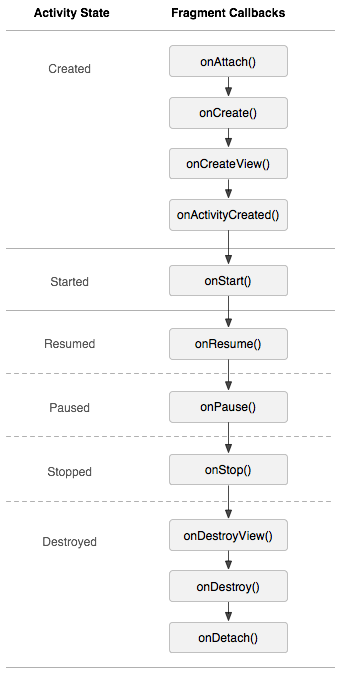

对于replace和add方式的选择，官方文档解释说：replace()这个方法只是在上一个Fragment不再需要时采用的简便方法。正确的切换方式是add()，切换时hide()，add()另一个Fragment；再次切换时，只需hide()当前，show()另一个。这样就能做到多个Fragment切换不重新实例化。

fragment的生命周期与activity的生命周期的一个关键区别就在于：fragment的生命周期方法是由托管acitivity而不是操作系统调用的。操作系统无从知晓activity用来管理视图的fragment。fragment的使用是activity自己内部的使用。

4、addToBackStack  
对于是否要加transaction.addToBackStack(null);也就是将Fragment加入到回退栈。官方的说法是取决于你是否要在回退的时候显示上一个Fragment。

### 14、Math中对于小数的处理
09-11 10:18:14.193 I: Math.ceil(109.82934) = 110.0  
09-11 10:18:14.193 I: Math.floor(109.82934) = 109.0  
09-11 10:18:14.193 I: Math.round(109.82934) = 110  
09-11 10:18:14.194 I: DecimalFormat 0.00 会四舍五入小数部分, 109.82964 约等于 109.83  
09-11 10:18:14.194 I: DecimalFormat #.00 会四舍五入小数部分, 109.82964 约等于 109.83  
09-11 10:18:14.195 I: String format %.2f 会四舍五入小数部分, 109.82964 约等于 109.83  
09-11 10:18:14.196 I: BigDecimal  3位小数 BigDecimal.ROUND_HALF_UP 会四舍五入小数部分, 109.82964 约等于 109.830  
09-11 10:18:14.196 I: BigDecimal  3位小数 BigDecimal.ROUND_DOWN 直接舍弃小数部分, 109.82964 约等于 109.829  
09-11 10:18:14.209 I: float型转json  : {"name":"Jack","score":0.01}  

### 15、开发经验整理
① 对于图片的处理，务必考虑使用缩略图  
② 类似订单状态和货架状态的需求，在有很多个状态的情况下，在开发之前最好整理各个状态对应的操作和文案；同时尽量做成一个Activity，避免跳转的时候跳转多界面的处理，同时对外的入参最好也只依赖一个orderId或者goodsId之类的，不要传递完整的对象，因为有可能其他模块提供不了完整对象。  
③ 订单的多个状态下，写了多个activity去匹配，这样的缺点是当有消息推送时，不能根据一个orderId准确的知道需要跳转到哪个界面去。  

### 16、ExpandableListView
① 更改箭头的位置  
调用setGroupIndicator(null);可以隐藏指示器  

可以在getGroupView中根据isExpanded来动态显示上箭头和下箭头
```java
@Override
public View getGroupView(final int groupPosition, boolean isExpanded, View convertView, ViewGroup parent) {

    ...

    if (!isExpanded) {
        Bitmap bitmap = BitmapFactory.decodeResource(context.getResources(), R.mipmap.icon_arrow_down_grey);
        BitmapDrawable bitmapDrawable = new BitmapDrawable(context.getResources(), bitmap);
        groupViewHolder.tv_game_schedule_num.setCompoundDrawablesWithIntrinsicBounds(null, null, bitmapDrawable, null);
    } else {
        Bitmap bitmap = BitmapFactory.decodeResource(context.getResources(), R.mipmap.icon_arrow_up_grey);
        BitmapDrawable bitmapDrawable = new BitmapDrawable(context.getResources(), bitmap);
        groupViewHolder.tv_game_schedule_num.setCompoundDrawablesWithIntrinsicBounds(null, null, bitmapDrawable, null);
    }

    return convertView;
}

```

② BaseExpandableListAdapter点击时，影响其他item的问题  
**问题**：造成此问题的原因是setGroupViewListener方法中先去获取了ExpandableListView当前的收起/展开状态，然后根据此状态再去调用collapseGroup或expandGroup，最后立即通过ExpandableListView.isGroupExpanded获取此时的收起/展开状态，此时的状态是不准确的。  

**解决方案**：在调用collapseGroup或expandGroup方法之后，监听onGroupExpanded和onGroupCollapsed方法，在其中调用notifyDataSetChanged();去刷新界面，然后在getGroupView中根据isExpanded去动态改变UI的上箭头还是下箭头。  

③ BaseExpandableListAdapter notifyDataSetChange()的问题  
**问题**：调用notifyDataSetChange()无效  

**分析**：开始以为是notifyDataSetChange没有刷新造成的，后台debug跟进到Adapter的getGroupView时，发现调用了getGroupView方法，也就是系统API执行了刷新操作，只是getGroupView中自己的逻辑处理有问题。当前如果是没有数据的情况，getGroupView展示的是item_no_data_layout布局，但是如果有数据进来，调用notifyDataSetChange时，会执行到getGroupView，此时会复用item_no_data_layout布局，但是此布局并不是我们的数据展示布局，所以要再加一层判断，如viewHolder==null，需要再加载一次item_offical_game布局到convertView  

**解决方案**：双层判断viewHolder==null，如果为null，需要再加载一次item_offical_game布局到convertView  

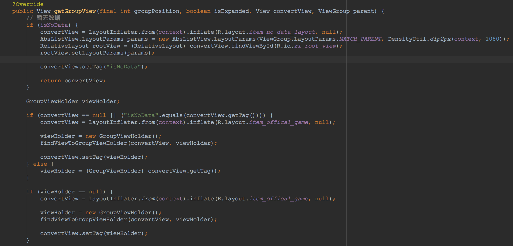

### 17、JSONArray ，JSONObject , json相互转换
```java
/**
 * jsonobject , jsonarray , json 互转
 */
public class Problem10_JSONArray_Activity extends BaseActivity {

    @Override
    protected void onCreate(Bundle savedInstanceState) {
        super.onCreate(savedInstanceState);
        setContentView(R.layout.activity_jsonarray);

        jsonStringTojsonObj();
        jsonArrayTojsonObj();
        jsonObjTojsonObj();
        listobjTojsonArray();
    }

    private void listobjTojsonArray() {
        List<String> imageList = new ArrayList<>();
        imageList.add("http://quncao-app.b0.upaiyun.com/51c1e24b6b821c916f732c2aa5b1dc9f.jpg");
        imageList.add("http://quncao-app.b0.upaiyun.com/8ad331112d30453d2ace4c31903c5c55.jpg");
        imageList.add("http://quncao-app.b0.upaiyun.com/839f7a8407047bab2d7a721c114912df.jpg");
        imageList.add("http://quncao-app.b0.upaiyun.com/369ca74245ebc32d512eae501e7de807.jpg");

        try {
            JSONArray jsonArray = new JSONArray(new Gson().toJson(imageList));

            Log.e("com.jsonarray", "listobjTojsonArray Gson ---- " + jsonArray.toString());

            JSONArray jsonArray2 = new JSONArray(imageList);
            Log.e("com.jsonarray", "listobjTojsonArray 直接转换 ---- " + jsonArray2.toString());

            Log.e("com.jsonarray", "-------------------- ");
        } catch (JSONException e) {
            e.printStackTrace();
        }
    }

    private void jsonObjTojsonObj() {
        JSONArray jsonArray = new JSONArray();
        jsonArray.put("http://quncao-app.b0.upaiyun.com/51c1e24b6b821c916f732c2aa5b1dc9f.jpg");
        jsonArray.put("http://quncao-app.b0.upaiyun.com/8ad331112d30453d2ace4c31903c5c55.jpg");
        jsonArray.put("http://quncao-app.b0.upaiyun.com/839f7a8407047bab2d7a721c114912df.jpg");
        jsonArray.put("http://quncao-app.b0.upaiyun.com/369ca74245ebc32d512eae501e7de807.jpg");

        JSONObject jsonObject = new JSONObject();
        try {
            jsonObject.put("imageList", jsonArray);
            jsonObject.put("age", 28);
            jsonObject.put("nickName", "Jack");
        } catch (JSONException e) {
            e.printStackTrace();
        }

        //直接调用toString可以将JSONObject转换成json字符串
        Log.e("com.jsonarray", "jsonObjTojsonObj ---- " + jsonObject.toString());

        Log.e("com.jsonarray", "jsonObjTojsonObj Gson ---- " + new Gson().toJson(jsonObject));

        Log.e("com.jsonarray", "-------------------- ");
    }

    private void jsonArrayTojsonObj() {
        JSONArray jsonArray = new JSONArray();
        jsonArray.put("http://quncao-app.b0.upaiyun.com/51c1e24b6b821c916f732c2aa5b1dc9f.jpg");
        jsonArray.put("http://quncao-app.b0.upaiyun.com/8ad331112d30453d2ace4c31903c5c55.jpg");
        jsonArray.put("http://quncao-app.b0.upaiyun.com/839f7a8407047bab2d7a721c114912df.jpg");
        jsonArray.put("http://quncao-app.b0.upaiyun.com/369ca74245ebc32d512eae501e7de807.jpg");

        //直接调用toString可以将JSONArray转换成json字符串
        Log.e("com.jsonarray", "jsonArrayTojsonObj ---- " + jsonArray.toString());

        Log.e("com.jsonarray", "-------------------- ");
    }

    private void jsonStringTojsonObj() {
        String imageObject = "{\"imageList\":[{\"id\": 292,\"imageUrl\": \"http://quncao-app.b0.upaiyun.com/51c1e24b6b821c916f732c2aa5b1dc9f.jpg\"},{\"id\": 289,\"imageUrl\": \"http://quncao-app.b0.upaiyun.com/8ad331112d30453d2ace4c31903c5c55.jpg\"},{\"id\": 288,\"imageUrl\": \"http://quncao-app.b0.upaiyun.com/839f7a8407047bab2d7a721c114912df.jpg\"},{\"id\": 291,\"imageUrl\": \"http://quncao-app.b0.upaiyun.com/369ca74245ebc32d512eae501e7de807.jpg\"}]}";
        FixedPrice fixedPrice = new Gson().fromJson(imageObject, FixedPrice.class);
        Log.e("com.jsonarray", "jsonStringTojsonObj ---- " + fixedPrice.toString());

        String imageArray = "[{\"id\": 292,\"imageUrl\": \"http://quncao-app.b0.upaiyun.com/51c1e24b6b821c916f732c2aa5b1dc9f.jpg\"},{\"id\": 289,\"imageUrl\": \"http://quncao-app.b0.upaiyun.com/8ad331112d30453d2ace4c31903c5c55.jpg\"},{\"id\": 288,\"imageUrl\": \"http://quncao-app.b0.upaiyun.com/839f7a8407047bab2d7a721c114912df.jpg\"},{\"id\": 291,\"imageUrl\": \"http://quncao-app.b0.upaiyun.com/369ca74245ebc32d512eae501e7de807.jpg\"}]";
        List<Image> imageList = new Gson().fromJson(imageArray, new TypeToken<List<Image>>() {
        }.getType());

        Log.e("com.jsonarray", "jsonStringTojsonObj gson fromJson ---- " + fixedPrice.toString());
        Log.e("com.jsonarray", "jsonStringTojsonObj TypeToken ---- " + imageList.toString());

        Log.e("com.jsonarray", "-------------------- ");
    }

    class Image {
        public int id;
        public String imageUrl;

        @Override
        public String toString() {
            return new Gson().toJson(this);
        }
    }

    class FixedPrice {
        public List<Image> imageList;

        @Override
        public String toString() {
            return new Gson().toJson(this);
        }
    }

}

```
